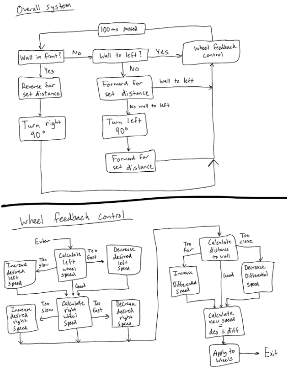

# Maze-Solver-Robot

Contributors: Jaden Tompkins

## Overview

Using a MSP-EXP432P401R with a TI-RSLK Robotic Car, we had developed code, implemented and guided the car through a maze using sensors and coding, for it to traverse through a maze automatically without external aid.

Our final solution uses a combination of an I2C ultrasonic ranger, and the use of bumpers on the car in order to traverse and solve the maze. In our method of solving the maze problem, we had developed a solution of using the "Left Hand Rule". This design uses the ultrasonic ranger to detect if there is a wall close enough to its left to deem it to be next to a wall, and the bumpers in order to find if there is a wall in front, and use distance based turning using encoders to detect if it had turned 90 degrees one way or another.

## How it Works

We wrote to start, to read in the sensor values from the car. From those values, we can do a checklist for what events must happen in order for the car to correct itself based off of those values

For when we detect a wall in front of the car, we must turn right. This is detected from any of the bumpers hitting the wall in front of it, where all bumpers are set to this function. In order to continue through the maze, we go backwards a certain distance to allow the car to turn, turning on its center to the right 90 degrees, and then looping back to the start.

If there isn’t a wall in front of it, then we must check if there is a wall to the left of the car. If there isn’t, then we must drive forwards a certain distance to clear the left wall. If the sensor then detects a wall again because of an error in the wall or the ranger sensor while driving the distance forward, then we stop this event altogether and go back to driving straight. If it drives the full distance in order for it to clear the wall, then make a 90 degree turn to the left until both motors average to a certain distance, and then drive forward until the wall detects another wall, or it drives a certain distance. 

Otherwise, if none of these events happen, then the car must just drive straight and correct itself based on its distance from the wall. 

After all of this is done, we also apply an integral control at the end in order for the car to correct itself based on the distance from the wall over time so the car doesn’t bump into the wall.

While this is all happening, the car also must drive straight, thus the encoders in the wheels must read how much the car is turning, using a simulated differentiation based off of the amount of degrees the wheel has turned and the measurements of the wheels and comparing the distance both wheels have traveled in order for the car to drive in a straight line in the long run. 

A more intuitive depiction can be shown through the flowchart below.

## Low-Level Design

To show how this design was implemented, [this psuedocode](code/psuedocode.txt) was created in order to show how this flowchart would translate into code.

## Conclusion

The general logic we used to traverse the maze worked very well, as following the left wall guarantees an eventual solution of the maze and our method caused the car to follow the wall successfully. Overall, more testing could be done to improve the efficiency of the car’s traversal. 

For example, we could modify our distance to wall equation to cause the car to travel straight along the wall it found. This would prevent it from hitting the wall at any sharp angles, which can cause the car to leave the wall it should be following, and possibly guide the car back to the wall at certain angles where it would otherwise drive too far away and do a full 90 degree turn. 

Another fix could be to figure out which bumpers were hit and use that to turn the car a certain angle which might allow it to follow straight alongside a wall. Both of these fixes would allow the car to stay along the wall it should be following better as well as keeping its travel parallel or perpendicular to the walls in the maze (assuming all straight walls at 90 degree angles to each other). 

In general, our car would at least follow the left wall even if not directly in a straight line, as the car would sometimes zig-zag along the wall, which would get it to the end but would sometimes cause it to miss the exit. Modifying the mechanisms to help the car maintain a path parallel to the wall would greatly improve the chances of successfully exiting the maze. 

Another issue that we abandoned was the compass. We were originally going to use the compass to maintain straight paths and turns of 90 degrees, but the compass wouldn’t reliably give us the proper heading, causing the car to spin nonstop trying to find the correct heading or other, similar issues. We decided to instead track the distance of the wheels to determine when a turn had been completed, similar to the methods used in previous labs. This was very successful for us and we were using a distance tracker in other stages of our method so it was easy enough to implement.

